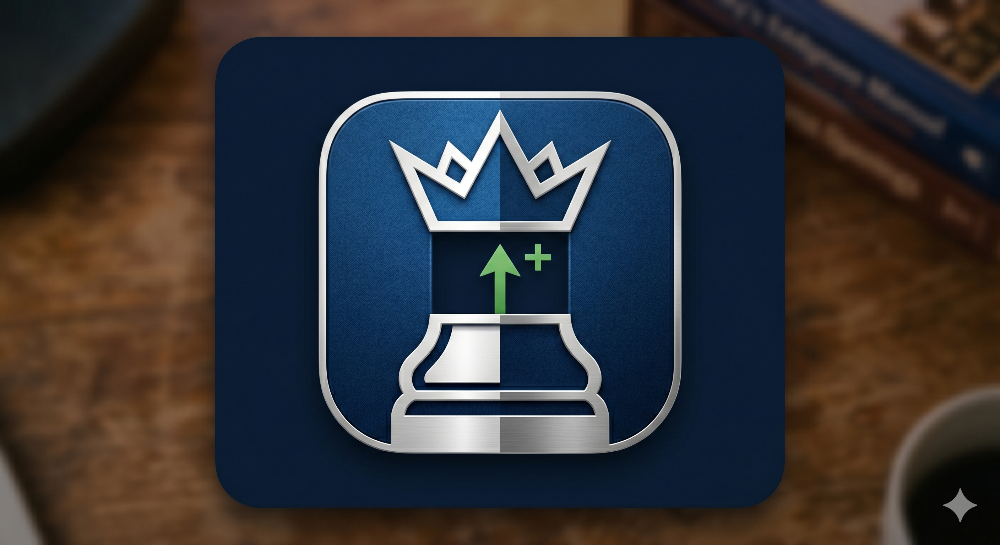

# Cabinet

> A desktop tool for studying chess opening repertoires from memory.



---

## Download

Grab the latest `.dmg` from [**Releases →**](../../releases)

---

## Features

| | |
|---|---|
| **Move tree** | Full branching variations. Arrow keys walk depth and sibling lines. |
| **Drill mode** | Play your repertoire from memory. Misses reveal the expected move; a final summary shows your score and every miss. |
| **Study tracking** | Per-move status — unseen, reviewing, known — with automatic spaced-repetition decay. |
| **Chapter support** | PGN comments like `{Chapter: The King's English}` organise lines with aggregate stats and one-click drilling. |
| **Engine analysis** | Stockfish 16 runs locally, no API key needed. Top-3 MultiPV arrows render directly on the board. |
| **PGN import/export** | Full round-trip: variations, NAGs, comments, and headers all preserved. |

---

## Keyboard shortcuts

| Key | Action |
|-----|--------|
| `←` / `→` | Step backward / forward |
| `↑` / `↓` | Cycle sibling variations |
| `Home` / `End` | Jump to start / end of mainline |
| `F` | Flip board |
| `?` | Show hint *(drill mode)* |
| `Esc` | End drill / deselect |

---

## Development

```bash
npm install
npm run dev        # esbuild watch + serve at http://localhost:8765
```

To package a local DMG:

```bash
npm run package    # builds bundle, then runs electron-builder
```

### Releases

Push a `v*.*.*` tag and the [GitHub Action](.github/workflows/release.yml) will build and publish the DMG automatically.

```bash
git tag v1.0.0 && git push origin v1.0.0
```

---

*Private — all rights reserved.*
